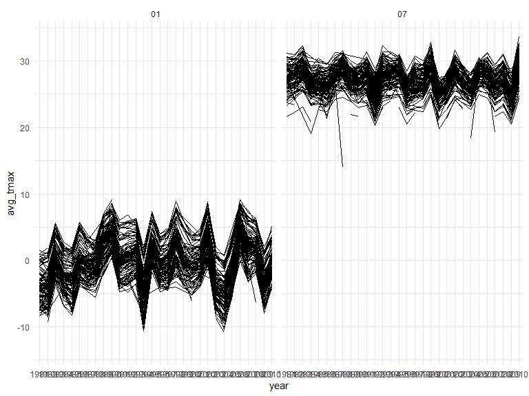
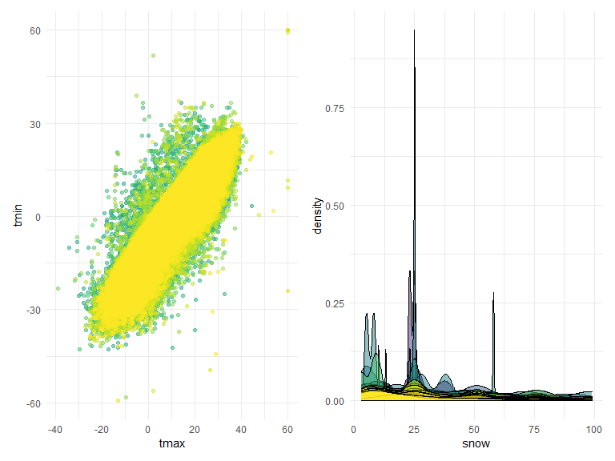

Data Science Homework 3
================
2022-10-17

Hemangi Modi (UNI: hbm2126)

# Problem 1

``` r
data("instacart")

instacart = 
  instacart %>% 
  as_tibble(instacart)
```

### Describing the dataset

The “instacart” dataset contains information on various variables that
pertain to orders placed on instacart. There are a couple of identifier
variables for the order, product, and the user that placed the order.
Other variables include the product name, the aisle, the department the
product is from, and days since prior order. There are 1384617
observations and 15 columns. In total, there are 39123 products found in
131209 orders from 131209 distinct users.

### Answering questions using the dataset

There are 134 aisles. Fresh fruits and fresh vegetables are the two
aisles that most items are ordered from.

``` r
instacart %>% 
  count(aisle) %>% 
  arrange(desc(n))
```

    ## # A tibble: 134 × 2
    ##    aisle                              n
    ##    <chr>                          <int>
    ##  1 fresh vegetables              150609
    ##  2 fresh fruits                  150473
    ##  3 packaged vegetables fruits     78493
    ##  4 yogurt                         55240
    ##  5 packaged cheese                41699
    ##  6 water seltzer sparkling water  36617
    ##  7 milk                           32644
    ##  8 chips pretzels                 31269
    ##  9 soy lactosefree                26240
    ## 10 bread                          23635
    ## # … with 124 more rows

Below is a plot that shows the number of items ordered in each aisle,
arranged in an ascending order.

``` r
instacart %>% 
  count(aisle) %>% 
  filter(n > 10000) %>% 
  mutate(aisle = fct_reorder(aisle, n)) %>% 
  ggplot(aes(x = aisle, y = n)) + 
  geom_point() + 
  labs(title = "Number of items ordered in each aisle") +
  theme(axis.text.x = element_text(angle = 60, hjust = 1))
```


The table below shows the 3 most popular items in the following aisles:
packaged vegetables & fruits, baking ingredients, and dog food and care,
and how many times those items were ordered.

``` r
instacart %>% 
  filter(aisle %in% c("baking ingredients", "dog food care", "packaged vegetables fruits")) %>% 
  group_by(aisle) %>% 
  count(product_name) %>% 
  mutate(rank = min_rank(desc(n))) %>% 
  filter(rank < 4) %>% 
  arrange(desc(n)) %>% 
  knitr::kable()
```

| aisle                      | product_name                                  |    n | rank |
|:---------------------------|:----------------------------------------------|-----:|-----:|
| packaged vegetables fruits | Organic Baby Spinach                          | 9784 |    1 |
| packaged vegetables fruits | Organic Raspberries                           | 5546 |    2 |
| packaged vegetables fruits | Organic Blueberries                           | 4966 |    3 |
| baking ingredients         | Light Brown Sugar                             |  499 |    1 |
| baking ingredients         | Pure Baking Soda                              |  387 |    2 |
| baking ingredients         | Cane Sugar                                    |  336 |    3 |
| dog food care              | Snack Sticks Chicken & Rice Recipe Dog Treats |   30 |    1 |
| dog food care              | Organix Chicken & Brown Rice Recipe           |   28 |    2 |
| dog food care              | Small Dog Biscuits                            |   26 |    3 |

The table below shows the mean hour of the day at which Pink Lady Apples
and Coffee Ice Cream are ordered on each day of the week.

``` r
instacart %>%
  filter(product_name %in% c("Pink Lady Apples", "Coffee Ice Cream")) %>%
  group_by(product_name, order_dow) %>%
  summarize(mean_hour = mean(order_hour_of_day)) %>%
  spread(key = order_dow, value = mean_hour) %>%
  knitr::kable(digits = 2)
```

    ## `summarise()` has grouped output by 'product_name'. You can override using the
    ## `.groups` argument.

| product_name     |     0 |     1 |     2 |     3 |     4 |     5 |     6 |
|:-----------------|------:|------:|------:|------:|------:|------:|------:|
| Coffee Ice Cream | 13.77 | 14.32 | 15.38 | 15.32 | 15.22 | 12.26 | 13.83 |
| Pink Lady Apples | 13.44 | 11.36 | 11.70 | 14.25 | 11.55 | 12.78 | 11.94 |

# Problem 2

``` r
accel_df = 
  read_csv("data/accel_data.csv") %>%
  janitor::clean_names() %>%
  pivot_longer(
    activity_1:activity_1440,
    names_to = "minute",
    names_prefix = "activity_",
    values_to = "activity_measure") %>% 
  select(week, day_id, everything()) %>% 
  mutate(
    weekend_weekday = case_when(day %in% c("Monday","Tuesday","Wednesday","Thursday","Friday") ~ "Weekday", day %in% c("Saturday","Sunday") ~ "Weekend"), 
    minute = as.integer(minute)
    ) 
```

    ## Rows: 35 Columns: 1443
    ## ── Column specification ────────────────────────────────────────────────────────
    ## Delimiter: ","
    ## chr    (1): day
    ## dbl (1442): week, day_id, activity.1, activity.2, activity.3, activity.4, ac...
    ## 
    ## ℹ Use `spec()` to retrieve the full column specification for this data.
    ## ℹ Specify the column types or set `show_col_types = FALSE` to quiet this message.

``` r
total_activity = 
  accel_df %>% 
  group_by(day, week) %>% 
  summarize(sum(activity_measure)) %>% 
  pivot_wider(
    names_from = "day",
    values_from = "sum(activity_measure)"
  ) %>% 
  select(week, Monday, Tuesday, Wednesday, Thursday, Friday, Saturday, Sunday) %>% 
  knitr::kable(digits = 2)
```

    ## `summarise()` has grouped output by 'day'. You can override using the `.groups`
    ## argument.

``` r
accel_df %>% 
  ggplot(aes(x = minute, y = activity_measure, color = day)) +
  geom_line()
```


# Problem 3

``` r
data("ny_noaa")

ny_noaa = 
  ny_noaa %>% 
  as_tibble(ny_noaa)
```

``` r
ny_noaa_tidy = 
  ny_noaa %>% 
  janitor::clean_names() %>% 
  separate(date, into = c("year", "month", "day"), sep = "-") %>%
  mutate(
    tmax = as.integer(tmax),
    tmin = as.integer(tmin),
    tmax = tmax/10,
    tmin = tmin/10,
    prcp = prcp/10
    ) 
```

``` r
avg_tmax_plot = 
  ny_noaa_tidy %>% 
  group_by(id, year, month) %>% 
  filter(month %in% c("01", "07")) %>% 
  summarize(avg_tmax = mean(tmax)) %>% 
  ggplot(aes(x = year, y = avg_tmax, group = id)) +
  geom_line() +
  facet_grid(~month)
```

    ## `summarise()` has grouped output by 'id', 'year'. You can override using the
    ## `.groups` argument.

``` r
avg_tmax_plot
```



``` r
tmax_tmin_plot = 
  ny_noaa_tidy %>% 
  ggplot(aes(x = tmax, y = tmin, color = id)) + 
  geom_point(alpha = .5) +
  theme(legend.position = "none")
```

``` r
snowfall_dist = 
  ny_noaa_tidy %>% 
  filter(snow > 0 & snow < 100) %>% 
  ggplot(aes(x = snow, fill = id)) + 
  geom_density(alpha = .5) + 
  theme(legend.position = "none")
```

``` r
combined_plot = tmax_tmin_plot + snowfall_dist
combined_plot
```


