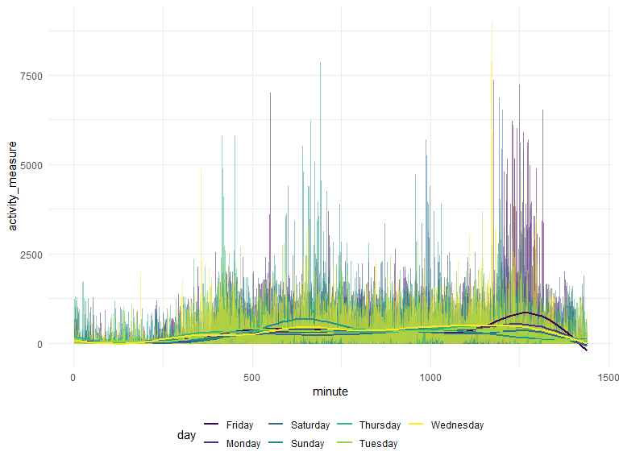

Data Science Homework 3
================
2022-10-17

Hemangi Modi (UNI: hbm2126)

# Problem 1

``` r
data("instacart")

instacart = 
  instacart %>% 
  as_tibble(instacart)
```

### Describing the dataset

The “instacart” dataset contains information on various variables that
pertain to orders placed on instacart. There are a couple of identifier
variables for the order, product, and the user that placed the order.
Other variables include the product name, the aisle, the department the
product is from, and days since prior order. There are 1384617
observations and 15 columns. In total, there are 39123 products found in
131209 orders from 131209 distinct users.

### Answering questions using the dataset

There are 134 aisles. Fresh fruits and fresh vegetables are the two
aisles that most items are ordered from.

``` r
instacart %>% 
  count(aisle) %>% 
  arrange(desc(n))
```

    ## # A tibble: 134 × 2
    ##    aisle                              n
    ##    <chr>                          <int>
    ##  1 fresh vegetables              150609
    ##  2 fresh fruits                  150473
    ##  3 packaged vegetables fruits     78493
    ##  4 yogurt                         55240
    ##  5 packaged cheese                41699
    ##  6 water seltzer sparkling water  36617
    ##  7 milk                           32644
    ##  8 chips pretzels                 31269
    ##  9 soy lactosefree                26240
    ## 10 bread                          23635
    ## # … with 124 more rows

Below is a plot that shows the number of items ordered in each aisle,
arranged in an ascending order.

``` r
instacart %>% 
  count(aisle) %>% 
  filter(n > 10000) %>% 
  mutate(aisle = fct_reorder(aisle, n)) %>% 
  ggplot(aes(x = aisle, y = n)) + 
  geom_point() + 
  labs(title = "Number of items ordered in each aisle") +
  theme(axis.text.x = element_text(angle = 60, hjust = 1))
```


The table below shows the 3 most popular items in the following aisles:
packaged vegetables & fruits, baking ingredients, and dog food and care,
and how many times those items were ordered.

``` r
instacart %>% 
  filter(aisle %in% c("baking ingredients", "dog food care", "packaged vegetables fruits")) %>% 
  group_by(aisle) %>% 
  count(product_name) %>% 
  mutate(rank = min_rank(desc(n))) %>% 
  filter(rank < 4) %>% 
  arrange(desc(n)) %>% 
  knitr::kable()
```

| aisle                      | product_name                                  |    n | rank |
|:---------------------------|:----------------------------------------------|-----:|-----:|
| packaged vegetables fruits | Organic Baby Spinach                          | 9784 |    1 |
| packaged vegetables fruits | Organic Raspberries                           | 5546 |    2 |
| packaged vegetables fruits | Organic Blueberries                           | 4966 |    3 |
| baking ingredients         | Light Brown Sugar                             |  499 |    1 |
| baking ingredients         | Pure Baking Soda                              |  387 |    2 |
| baking ingredients         | Cane Sugar                                    |  336 |    3 |
| dog food care              | Snack Sticks Chicken & Rice Recipe Dog Treats |   30 |    1 |
| dog food care              | Organix Chicken & Brown Rice Recipe           |   28 |    2 |
| dog food care              | Small Dog Biscuits                            |   26 |    3 |

The table below shows the mean hour of the day at which Pink Lady Apples
and Coffee Ice Cream are ordered on each day of the week.

``` r
instacart %>%
  filter(product_name %in% c("Pink Lady Apples", "Coffee Ice Cream")) %>%
  group_by(product_name, order_dow) %>%
  summarize(mean_hour = mean(order_hour_of_day)) %>%
  spread(key = order_dow, value = mean_hour) %>%
  knitr::kable(digits = 2)
```

    ## `summarise()` has grouped output by 'product_name'. You can override using the
    ## `.groups` argument.

| product_name     |     0 |     1 |     2 |     3 |     4 |     5 |     6 |
|:-----------------|------:|------:|------:|------:|------:|------:|------:|
| Coffee Ice Cream | 13.77 | 14.32 | 15.38 | 15.32 | 15.22 | 12.26 | 13.83 |
| Pink Lady Apples | 13.44 | 11.36 | 11.70 | 14.25 | 11.55 | 12.78 | 11.94 |

# Problem 2

``` r
accel_df = 
  read_csv("data/accel_data.csv") %>%
  janitor::clean_names() %>%
  pivot_longer(
    activity_1:activity_1440,
    names_to = "minute",
    names_prefix = "activity_",
    values_to = "activity_measure") %>% 
  select(week, day_id, everything()) %>% 
  mutate(
    weekend_weekday = case_when(day %in% c("Monday","Tuesday","Wednesday","Thursday","Friday") ~ "Weekday", day %in% c("Saturday","Sunday") ~ "Weekend"), 
    minute = as.integer(minute)
    ) 
```

    ## Rows: 35 Columns: 1443
    ## ── Column specification ────────────────────────────────────────────────────────
    ## Delimiter: ","
    ## chr    (1): day
    ## dbl (1442): week, day_id, activity.1, activity.2, activity.3, activity.4, ac...
    ## 
    ## ℹ Use `spec()` to retrieve the full column specification for this data.
    ## ℹ Specify the column types or set `show_col_types = FALSE` to quiet this message.

### Describing resulting dataset

After cleaning the dataset in the code chunk above, the resulting
dataset has 50400 observations and 6 variables. The dataset contains the
following variables: what day and week the observation is from, the
minute of the day (the observations were recorded at one-minute
intervals) associated with the observation, the actual physical activity
measure, and a variable that indicates whether this observation was
recorded on a weekday or a weekend.

The table below shows total activity per day across each one of the 5
weeks. There are no apparent patterns in the table. However, it is worth
noting that for weeks 4 and 5, the total activity per day on the
weekends was much lower than on the weekdays.

``` r
total_activity = 
  accel_df %>% 
  group_by(day, week) %>% 
  summarize(sum(activity_measure)) %>% 
  pivot_wider(
    names_from = "day",
    values_from = "sum(activity_measure)"
  ) %>% 
  select(week, Monday, Tuesday, Wednesday, Thursday, Friday, Saturday, Sunday) %>% 
  knitr::kable(digits = 2)
```

    ## `summarise()` has grouped output by 'day'. You can override using the `.groups`
    ## argument.

``` r
total_activity
```

| week |    Monday |  Tuesday | Wednesday | Thursday |   Friday | Saturday | Sunday |
|-----:|----------:|---------:|----------:|---------:|---------:|---------:|-------:|
|    1 |  78828.07 | 307094.2 |    340115 | 355923.6 | 480542.6 |   376254 | 631105 |
|    2 | 295431.00 | 423245.0 |    440962 | 474048.0 | 568839.0 |   607175 | 422018 |
|    3 | 685910.00 | 381507.0 |    468869 | 371230.0 | 467420.0 |   382928 | 467052 |
|    4 | 409450.00 | 319568.0 |    434460 | 340291.0 | 154049.0 |     1440 | 260617 |
|    5 | 389080.00 | 367824.0 |    445366 | 549658.0 | 620860.0 |     1440 | 138421 |

The plot below shows the 24-hour activity time courses for each day.
Some patterns that are apparent from this plot: Wednesday and Friday
have some of the highest activity measures in the week. Most activity
starts picking up after the 250th minute, on all days, and plateaus
around the 750th minute, and picks up again a little bit around the
1200th minute.

``` r
accel_df %>% 
  ggplot(aes(x = minute, y = activity_measure, color = day)) +
  geom_line(alpha = .5) +
  geom_smooth(se = FALSE)
```

    ## `geom_smooth()` using method = 'gam' and formula 'y ~ s(x, bs = "cs")'



# Problem 3

``` r
data("ny_noaa")

ny_noaa = 
  ny_noaa %>% 
  as_tibble(ny_noaa)
```

### Describing the dataset

The NY NOAA dataset has 2595176 observations and 7 variables. This
dataset contains weather data for all New York state weather stations
from 1981-01-01 to 2010-12-31 The variables in this dataset include the
station ID, the date of observation, precipitation (in tenths of mm),
snowfall (in mm), snow depth (in mm), and maximum and minimum
temperatures (in tenths of degrees). This dataset contains a lot of
missing values: more precisely, there are 3387623 rows with missing
values in this data.

``` r
ny_noaa_tidy = 
  ny_noaa %>% 
  janitor::clean_names() %>% 
  separate(date, into = c("year", "month", "day"), sep = "-") %>%
  mutate(
    tmax = as.integer(tmax),
    tmin = as.integer(tmin),
    tmax = tmax/10,
    tmin = tmin/10,
    prcp = prcp/10
    ) 
```

### Answering questions about the dataset (after tidying)

The most commonly observed value for snowfall is 0 mm. I think this
makes sense because it only snows during the winter months and even in
the winter months, it does not snow everyday. Therefore, for most days
in the year, we would expect no snowfall. As seen in the table below,
the second most common value is NA/missing. This may be because there
snowfall data was not collected every day in the year.

``` r
ny_noaa_tidy %>% 
  count(snow) %>% 
  mutate(rank = min_rank(desc(n))) %>%
  filter(rank < 4) %>% 
  arrange(desc(n)) %>% 
  knitr::kable()
```

| snow |       n | rank |
|-----:|--------:|-----:|
|    0 | 2008508 |    1 |
|   NA |  381221 |    2 |
|   25 |   31022 |    3 |

### Making plots

The plot below shows the average max temperature in January and July in
each station across years. The average max temperature is much higher in
July than in January, which makes sense. There are cyclical patterns
where the average max temperature increases and decreases, that is more
or less consistent across the years and across the months. There are no
outliers as such.

``` r
avg_tmax_plot = 
  ny_noaa_tidy %>% 
  group_by(id, year, month) %>% 
  filter(month %in% c("01", "07")) %>% 
  mutate(
    month = recode(month, "01" = "Jan", "07" = "July")
  ) %>% 
  summarize(avg_tmax = mean(tmax)) %>% 
  ggplot(aes(x = year, y = avg_tmax, group = id, color = month)) +
  geom_line() +
  facet_grid(~month) +
  theme(axis.text.x = element_text(angle = 60, hjust = 1))
```

    ## `summarise()` has grouped output by 'id', 'year'. You can override using the
    ## `.groups` argument.

``` r
avg_tmax_plot
```


``` r
tmax_tmin_plot = 
  ny_noaa_tidy %>% 
  ggplot(aes(x = tmax, y = tmin)) + 
  geom_hex() +
  theme(legend.position = "right")
```

``` r
snowfall_dist = 
  ny_noaa_tidy %>% 
  filter(snow > 0 & snow < 100) %>%
  ggplot(aes(x = snow, y = year)) + 
  geom_density_ridges(scale = .85)
```

``` r
combined_plot = tmax_tmin_plot + snowfall_dist
combined_plot
```

    ## Picking joint bandwidth of 3.76


